# 智能教育平台（软件开发综合实践课程项目）

> **项目定位**：集成人工智能（LLM + 本地知识库）的现代化教育管理系统，为**学生 / 教师 / 管理员**提供完整的数字化教学解决方案。  
> **核心目标**：教学智能化、管理数字化、学习个性化、数据可视化，并支持线上部署与运维。

---

## 1. 项目概述

“智能教育平台”面向实训教学场景，解决传统教学中备课与练习编写成本高、学生缺少即时答疑与反馈、管理侧缺少数据决策支撑等问题。平台通过**DeepSeek AI API + 本地知识库（FAISS）**实现语义检索与智能问答，并提供面向不同角色的业务模块与数据大屏。

### 1.1 关键能力
- **学生端**：学习仪表板、课程学习、练习系统、AI 学习助手、个性化建议
- **教师端**：课程/练习创建与管理、学生学情管理、知识库管理、AI 辅助生成、教学数据概览
- **管理员端**：用户/资源管理、教师统计、学生统计、系统状态监控、数据大屏概览

---
截图


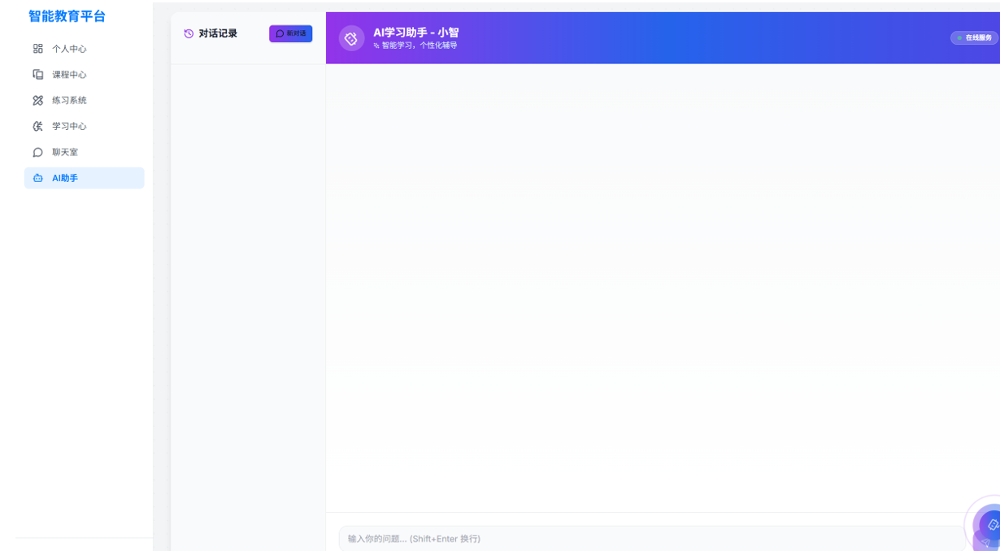
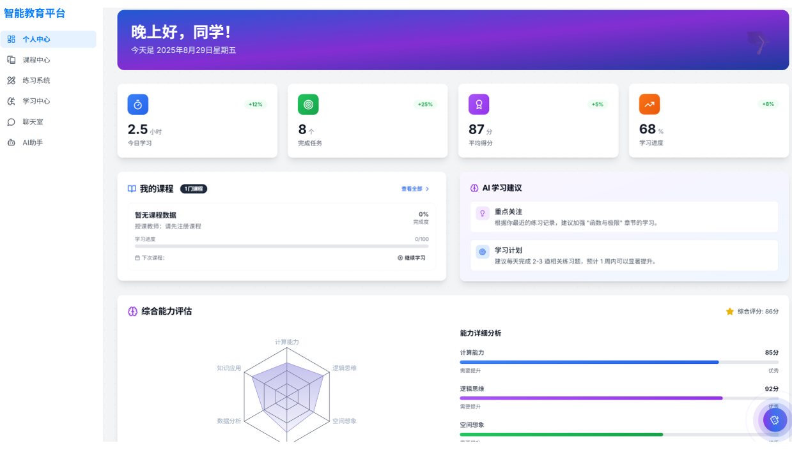
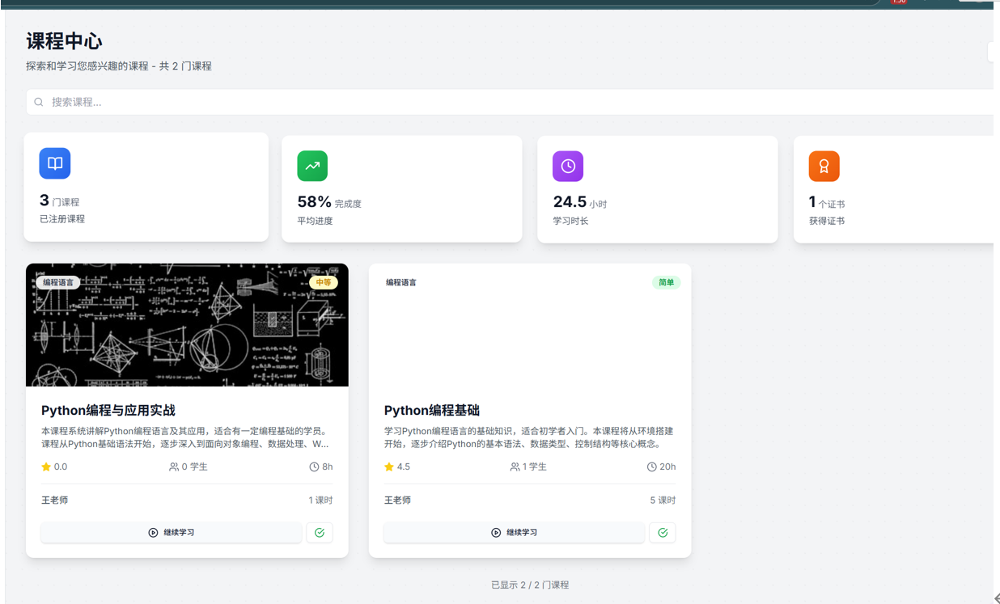
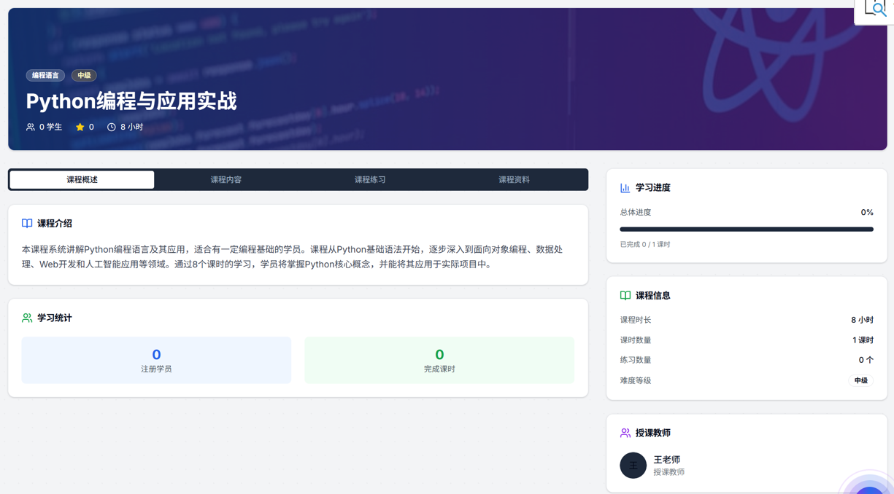
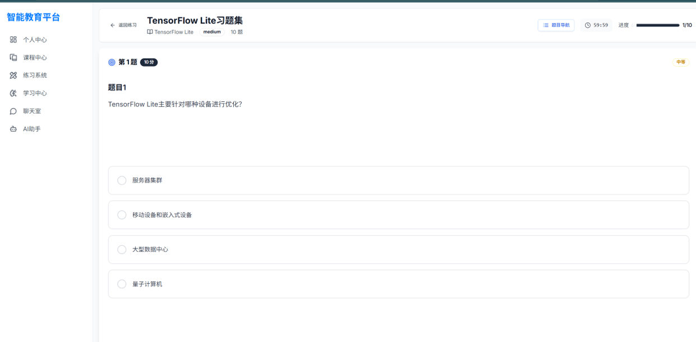
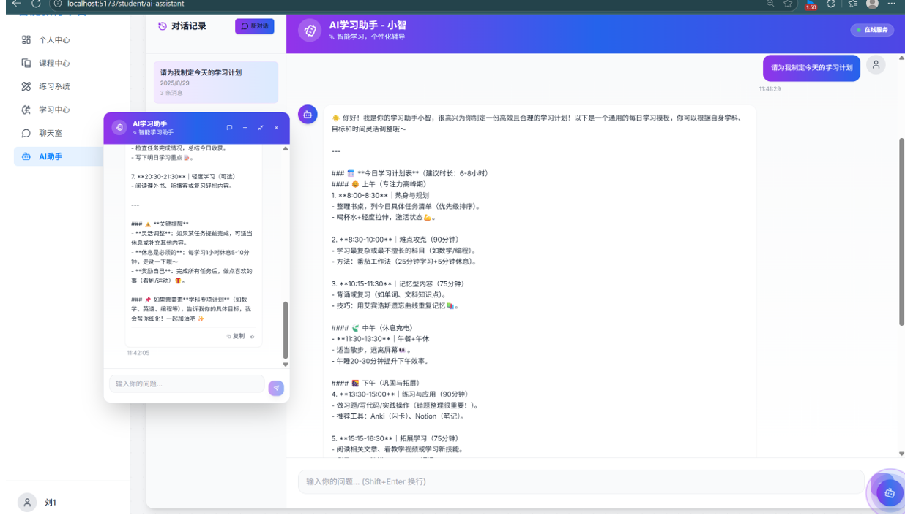
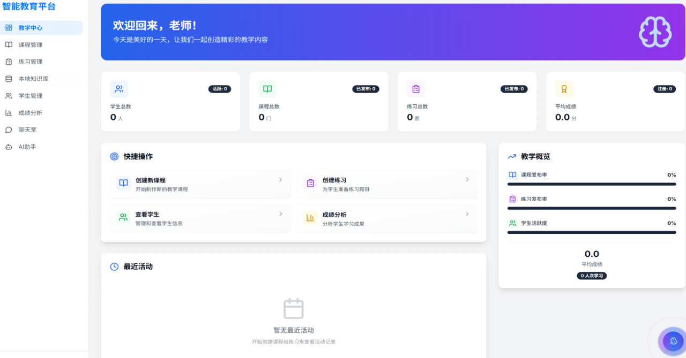
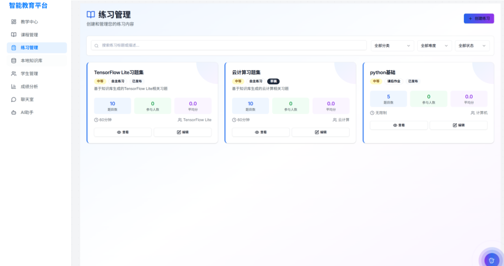
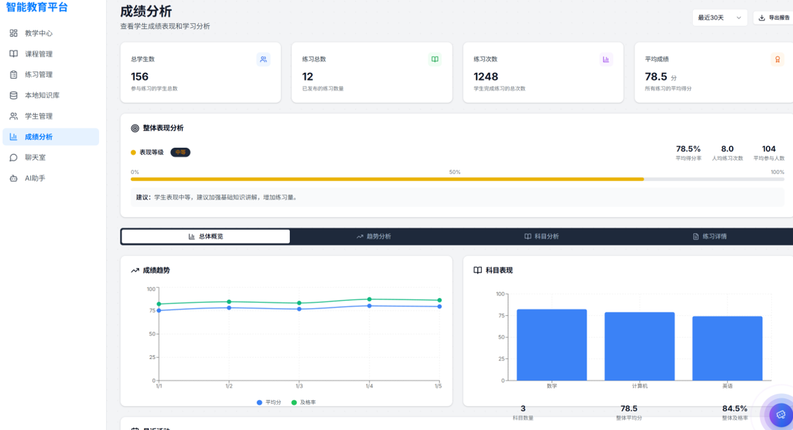
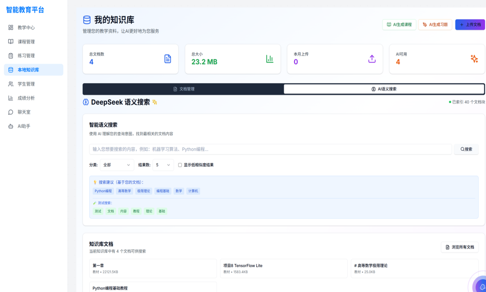
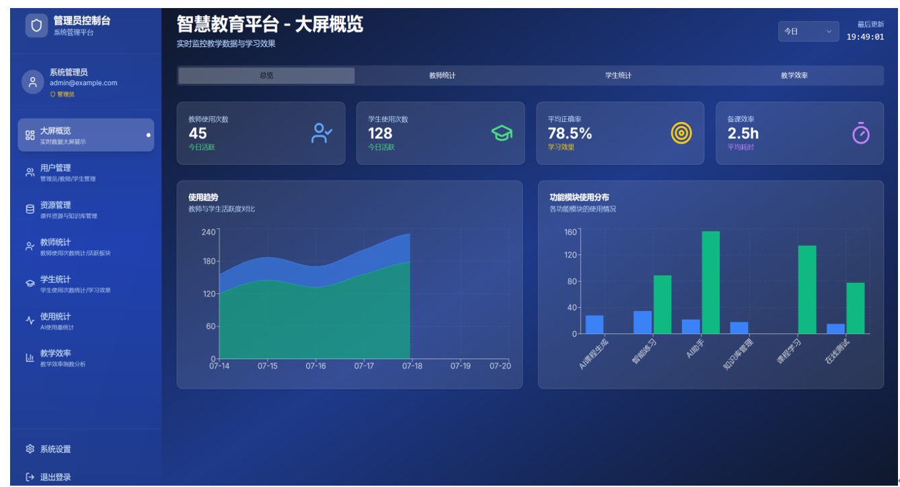
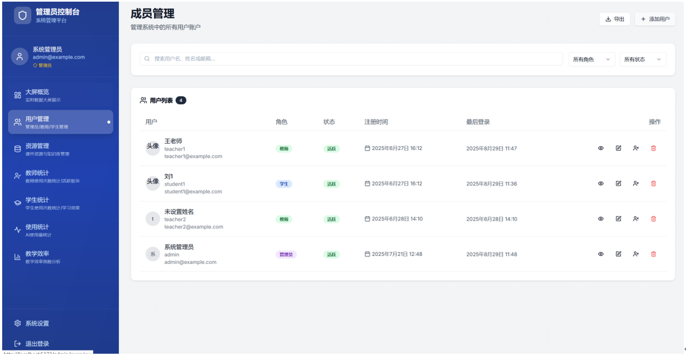
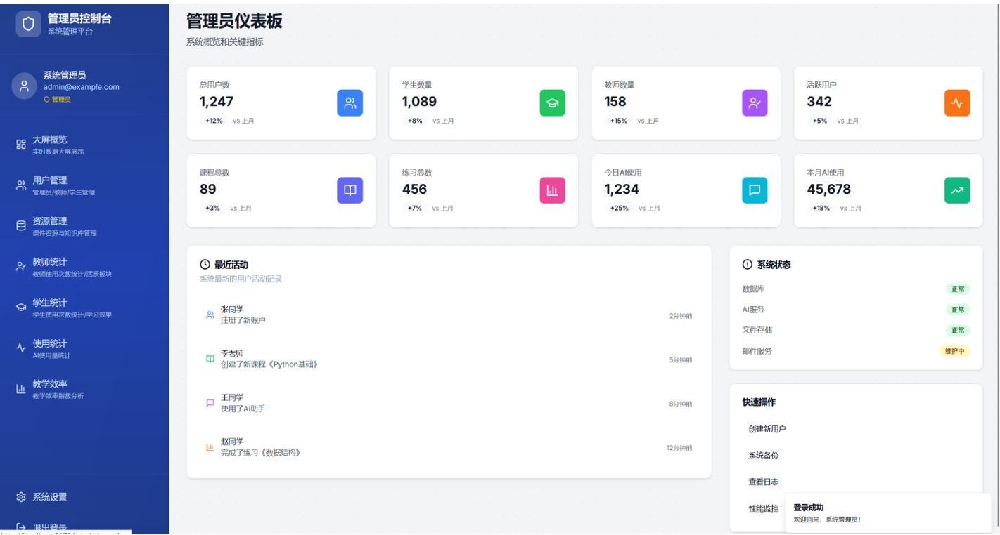
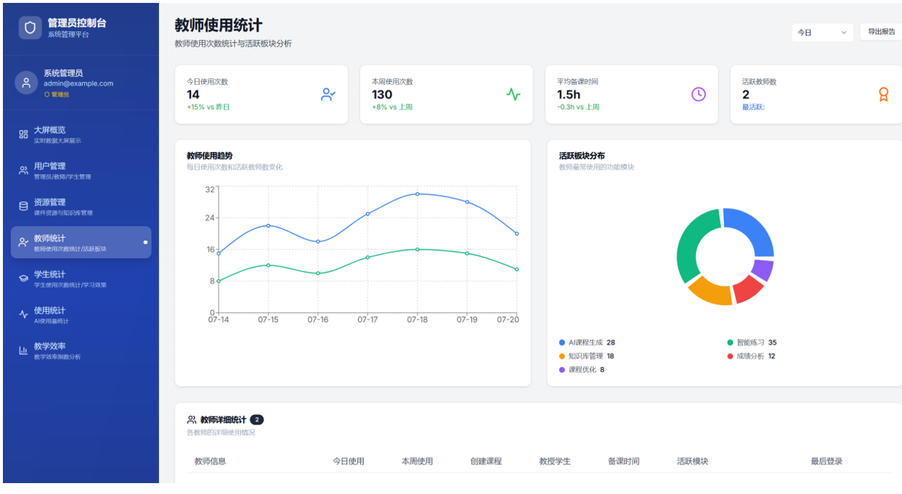
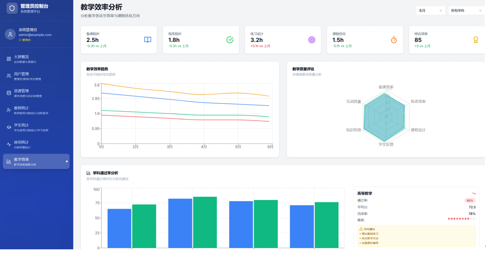
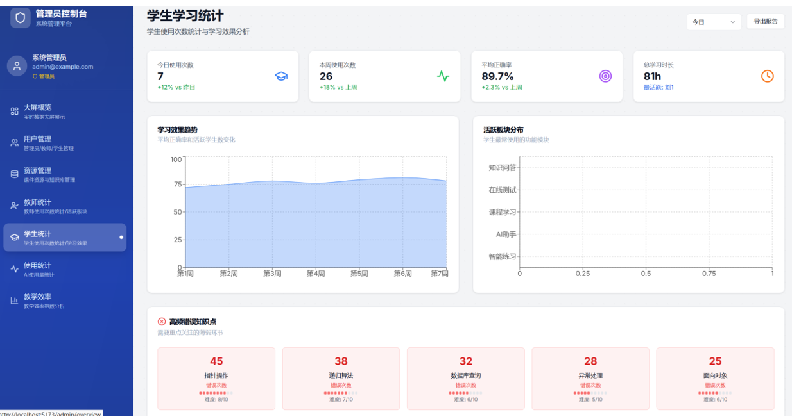
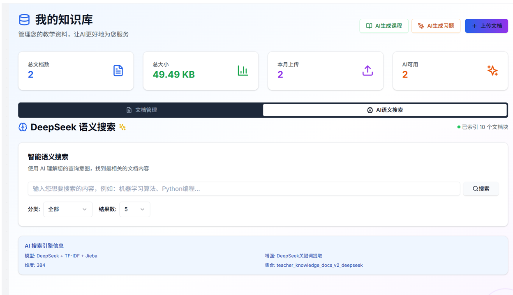
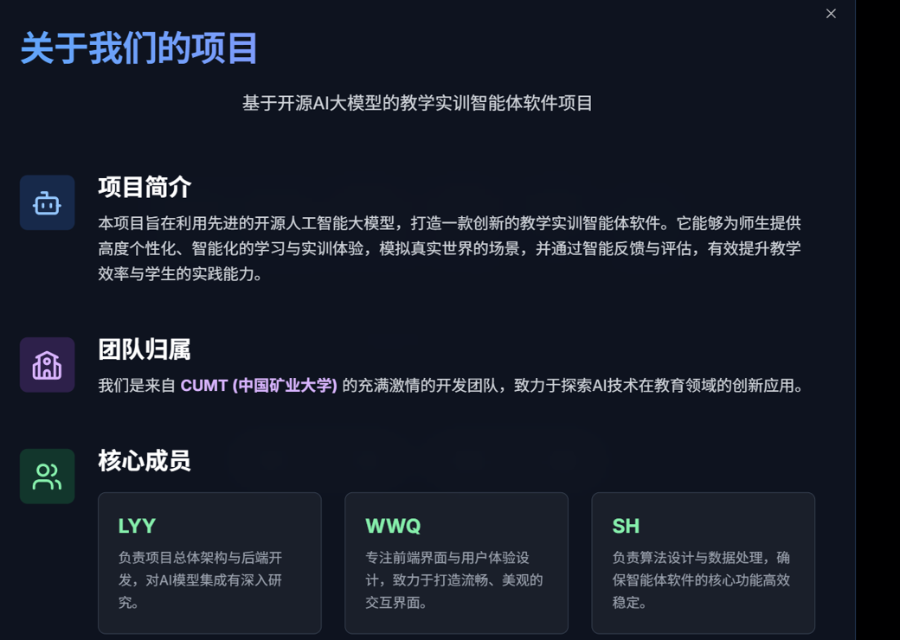


## 2. 技术架构

### 2.1 前后端分离
- **前端**：React + TypeScript（Vite 构建）  
  - UI：Tailwind CSS + shadcn/ui（组件体系）
  - 动效：Framer Motion
  - 可视化：Recharts（折线/柱状/饼图/雷达/面积等）
  - 状态：React Context
  - 路由：React Router（多角色路由）
- **后端**：Python FastAPI  
  - ORM：SQLAlchemy
  - 数据库：SQLite（开发），可扩展到 PostgreSQL/MySQL（生产）
  - 认证：JWT
  - 密码：bcrypt
  - 日志：Loguru
  - 文件：文档上传/解析/存储
- **AI 集成**：DeepSeek AI API + FAISS 向量库  
  - 文档解析：PDF / Word / Markdown
  - 语义搜索：向量召回 + 多轮对话上下文管理

### 2.2 系统模块（逻辑视图）
- **业务模块**：课程管理、练习系统、学生管理、成绩分析、知识库管理、AI 助手、数据看板
- **基础设施**：认证与权限、日志审计、文件存储、向量索引、缓存（Redis，可选）

---

## 3. 目录结构（示例）

```text
softwareCup/
├── frontend/                 # 前端
│   ├── src/
│   │   ├── components/       # 通用组件
│   │   ├── pages/            # 页面
│   │   │   ├── public/       # 公共页面
│   │   │   ├── student/      # 学生端
│   │   │   ├── teacher/      # 教师端
│   │   │   └── admin/        # 管理员端
│   │   ├── contexts/         # 全局状态
│   │   └── routes/           # 路由配置
└── backend/                  # 后端
    ├── app/
    │   ├── api/              # 路由与接口
    │   ├── services/         # 业务服务（AI/RAG/检索等）
    │   ├── models/           # ORM 模型
    │   ├── schemas/          # Pydantic 校验
    │   └── utils/            # 工具与中间件
    └── requirements.txt
```

---

## 4. 路由设计（多角色）

### 4.1 学生端
- `/student/dashboard`：学习概览
- `/student/courses`：课程列表
- `/student/exercises`：练习列表
- `/student/ai-assistant`：AI 助手
- `/student/profile`：个人资料

### 4.2 教师端
- `/teacher/dashboard`：教学概览
- `/teacher/courses`：课程管理
- `/teacher/exercises`：练习管理
- `/teacher/students`：学生管理
- `/teacher/knowledge-base`：知识库管理
- `/teacher/ai-assistant`：教学 AI 助手

### 4.3 管理员端
- `/admin/overview`：大屏概览
- `/admin/users`：用户管理
- `/admin/resources`：资源管理
- `/admin/teachers`：教师统计
- `/admin/students`：学生统计

---

## 5. 核心技术实现

### 5.1 身份认证与权限控制
- **JWT**：访问令牌 + 刷新机制（可选）
- **RBAC**：基于角色的访问控制（学生/教师/管理员）
- **bcrypt**：密码加密存储
- 前端：在请求拦截器中自动附加 Token；路由守卫控制页面访问

### 5.2 AI 服务架构（DeepSeek + RAG）
- 统一封装 DeepSeek API，维护对话上下文支持多轮交互
- **知识库流程**：
  1) 文档上传（PDF/Word/MD）  
  2) 文档解析与切分（chunking）  
  3) 向量化（embedding）  
  4) 写入 FAISS 索引（TopK 召回）  
  5) 将召回片段拼接进提示词，执行 grounded 生成  
  6) 输出答案并返回引用片段（可追溯）

> 备注：文档中也提到 SQLite FTS5 可用于全文检索与文档内容索引（可与向量检索形成互补）。

### 5.3 数据可视化与看板
- 通过 Recharts 实现：折线图（趋势）、柱状图（对比）、饼图（比例）、雷达图（多维能力）、面积图（累计）等
- 支持管理侧的 KPI 汇总、趋势分析、模块使用分布与学习效果统计

---

## 6. 功能模块说明（按角色）

### 6.1 学生端
- **学习仪表板**：学习时长、完成度、正确率、学习建议等
- **课程学习**：课程列表/详情/章节内容、多媒体支持、进度跟踪
- **练习系统**：多题型练习、自动评分（按实现）
- **AI 助手**：答疑、学习辅导、个性化建议

### 6.2 教师端
- **教师仪表板**：教学统计、学生活跃度、课程/练习发布率、快捷操作、最近活动
- **课程管理**：创建/编辑/发布，富文本编辑，章节管理（可拖拽排序），AI 辅助生成课程内容
- **练习管理**：练习创建、题目编辑、答案与评分标准、发布与结果分析，支持 AI 快速生成题目
- **学生管理**：学生列表/详情、学习进度、练习记录、学习报告（可导出 PDF，按实现）
- **知识库管理**：文档上传、列表与分类、语义检索；基于知识库 + LLM 生成课程/练习

### 6.3 管理员端
- **用户管理**：创建/编辑/禁用、重置密码、筛选搜索、CSV 导入导出（按实现）
- **资源管理**：课程/练习/知识库资源管理，审核与分类、备份与清理（按实现）
- **教师/学生统计**：活跃度、内容创建、覆盖学生、教学/学习效果指标、AI 使用情况等


---

## 7. 部署与运维

### 7.1 开发环境
- OS：Windows / macOS / Linux
- Python：3.9+
- Node.js：18+
- DB：SQLite（开发）；PostgreSQL/MySQL（生产可选）

### 7.2 生产环境（Huawei Cloud ECS）
- 服务器建议：4C8G+，SSD 100GB+
- 支持两种方式：
  - **Docker 部署**：构建镜像 + docker-compose 编排；可选 Nginx 反向代理 + SSL
  - **传统部署**：后端 Gunicorn/uWSGI + 前端静态文件部署 + Nginx/Apache

### 7.3 监控建议
- 性能：API 响应时间、CPU/内存/磁盘、数据库连接与慢查询
- 错误：日志收集、异常报警、AI 调用失败率
- 业务：用户活跃、功能使用频率、AI 调用统计与质量反馈

---


## 8. 总结

本项目以“AI + 教学业务闭环”为核心，完成了从需求分析、系统设计、全栈实现到线上部署的完整工程实践。系统在多角色业务、RAG 知识库、AI 助手、数据看板与可部署性方面具备较强的综合能力，可作为教学管理与学习辅助的原型系统持续迭代。

